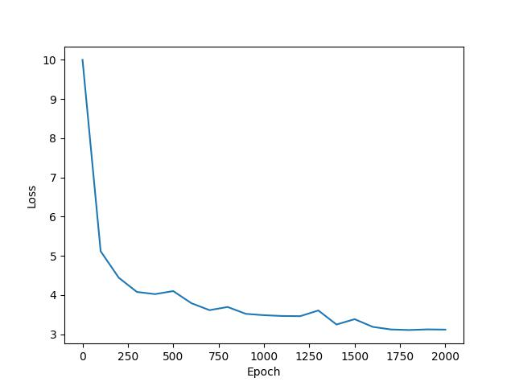

# harry-GPoTter

harry-GPoTter is a transformer text generation model implemented in PyTorch. It has been trained on text from all 7 books from from all 7 books of the Harry Potter series. In only 10 minutes of training with the free tier of [Google Colaboratory](https://colab.research.google.com/), the model learnt to generate coherent and grammatically correct sentences.

## Text Generation with harry-GPoTter

> “Ah,” said Mrs. Weasley, hiscolored lips looking unpleasant. “He wasn’t talking about her, he has tried to think he was saying he had looked up. The bleers were flooding.”
>
> “My master died?” whispered Voldemort, but the wasnoddenbling until he are, making to be seeing him.
>
> “I’ll see you, Professor Lockhart,” said Hermione, “but so surely now to have solid on it out of her whole bed! You’re thinking —
>
> “Oh hello the unconscious!”
>
> “And now blimey,” said Harry, “it was a very serious for an enormous mother. ...”

## Model Details

harry-GPoTter is a relatively small language model with 56M parameters (less than 1/2x of smallest gpt-2). It contains 8 layers of 8 headed attention with a hidden size of 384. It supports a maximum sequence length of 128. For tokenization, we use the same tokenizer as text-davinci-003, which has a vocabulary of 50,280 in total.

The model was trained for 2000 epochs in about 10 minutes with the free tier of Google Colab GPU Runtime. It achieves a cross-entropy loss of 3.1189.

This model was built for learning purposes. You can probably get better performance by finetuning a pre-trained model.

## Credits
- The text files were downloaded from [kaggle](https://www.kaggle.com/datasets/balabaskar/harry-potter-books-corpora-part-1-7)
- I referenced this [tutorial](https://www.youtube.com/watch?v=kCc8FmEb1nYhttps://www.youtube.com/watch?v=kCc8FmEb1nY) by Andrej Karpathy for some parts of the code
